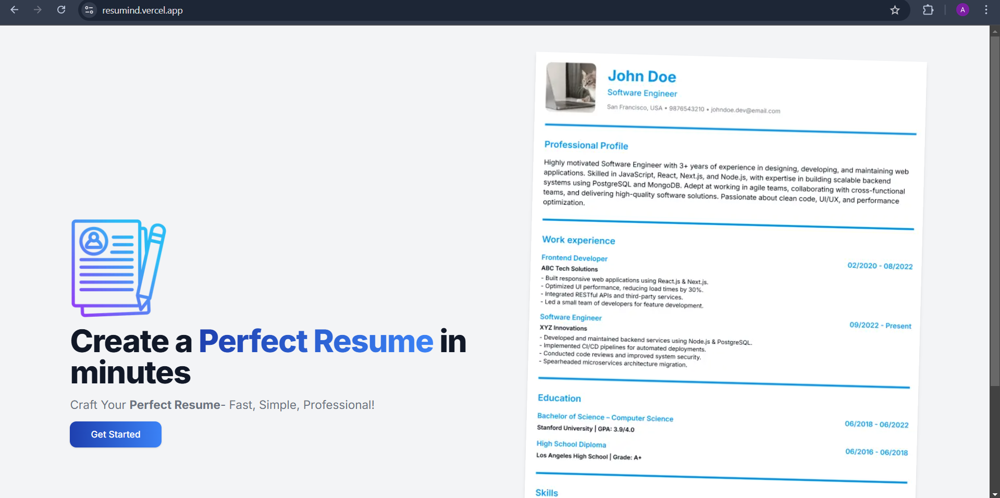
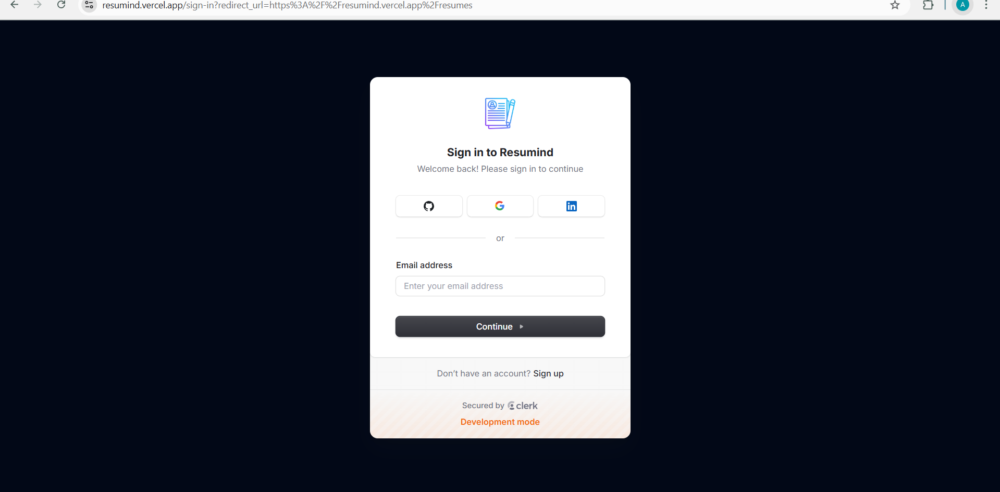
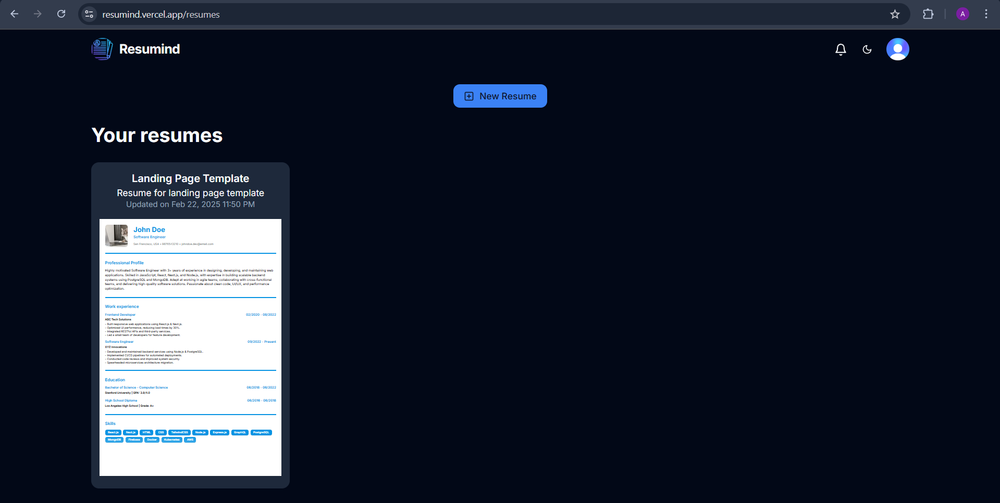
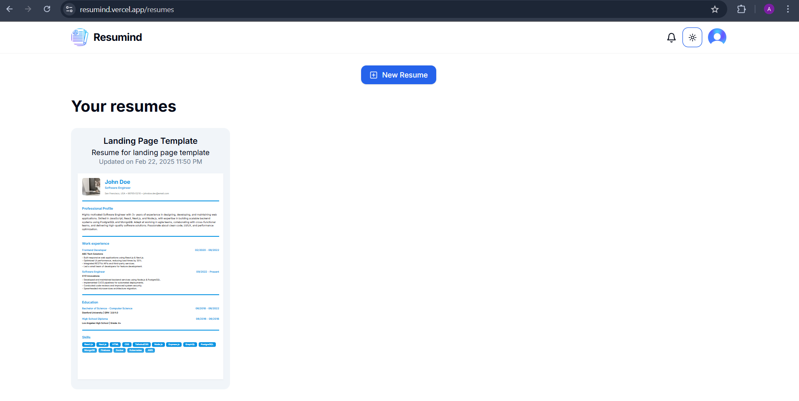
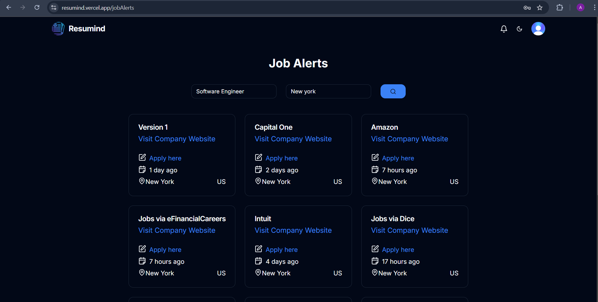
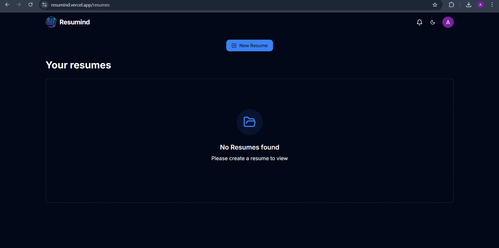

# Table of contents
- [Description](#resumind---ai-powered-resume-builder)  
- [Features](#features)  
- [Screenshots](#screenshots)  
- [Tech Stack](#tech-stack)  
- [Usage](#usage)  
- [License](#license)    

# Resumind - AI powered Resume builder
Resumind is a smart and intuitive AI-powered resume builder that helps users create professional, well-structured resumes with ease. Designed to streamline the resume creation process, Resumind offers real-time editing, customization, and PDF generation while integrating job alerts and industry insights. Built with a full-stack architecture, Resumind provides secure authentication, efficient data storage, and a seamless user experience, making it the ultimate tool for job seekers looking to craft the perfect resume.

# Features
🔒 Secure Authentication – User accounts are protected with authentication, ensuring secure access to personal data.  
📝 Real-Time Resume Builder – Users can create and edit their resumes with an instant live preview.  
💾 Autosave Functionality – Never lose progress! Changes are automatically saved as users update their resumes.  
🎨 Customization Options – Choose from various templates, fonts, and styles to personalize resumes.  
📄 PDF Generation – One-click PDF export to download a polished, professional resume.  
💼 AI-Powered Job Alerts – Fetches real-time job openings and industry insights based on user preferences.  
📊 Data Management & Storage – Efficiently stores user profiles, resumes, and preferences for a smooth experience.  
📱 Fully Responsive UI – A seamless and mobile-friendly experience, ensuring smooth navigation across all devices.  

# Screenshots
Login page

Front page - displays all the resumes created by the user. Light and dark theme.

  
Editor page

Real-Time Resume Builder with autosave functionality

Job Alerts - fetching api

Empty state for new users

# Tech stack
### Frontend
Next.js – Full-stack framework for React  
React.js – Component-based UI library  
TypeScript – Strongly-typed JavaScript  
Tailwind CSS – Utility-first styling framework  

### Backend
Next.js API Routes – Backend logic and endpoints  
PostgreSQL – Relational database  
Prisma ORM – Database management and queries  
Neon PostgreSQL – Cloud-based PostgreSQL database  

### Other integration  
Zod – Schema validation  
Gemini API - AI integration  
Rapid API - Job search API

# Usage
Resumind is live and deployed. You can access it here:  
https://resumind.vercel.app/

# License
This project is not open-source.  
Unauthorized copying, modification, or redistribution of this code is not permitted.
